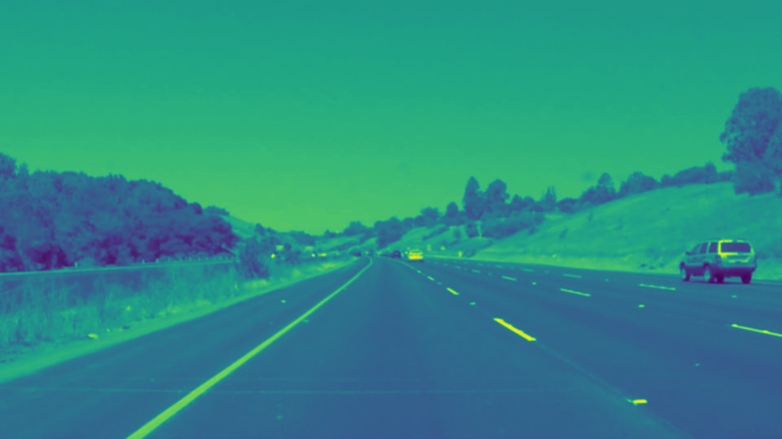
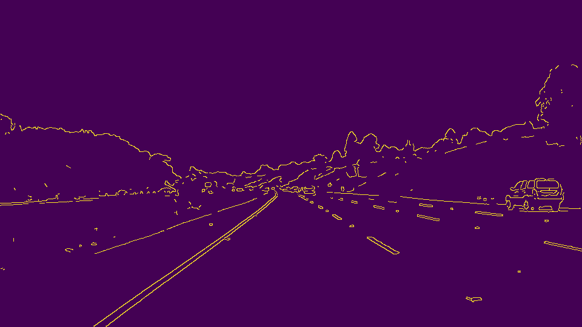
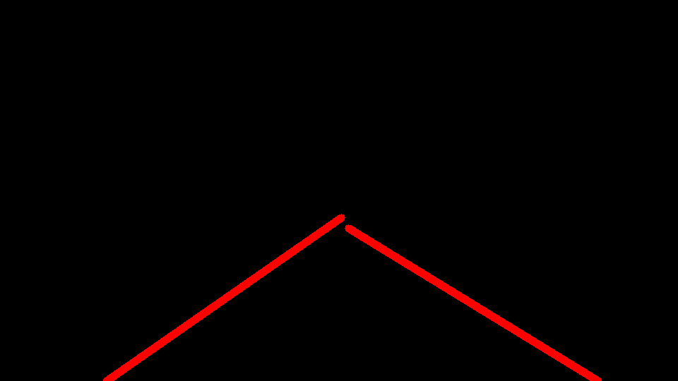
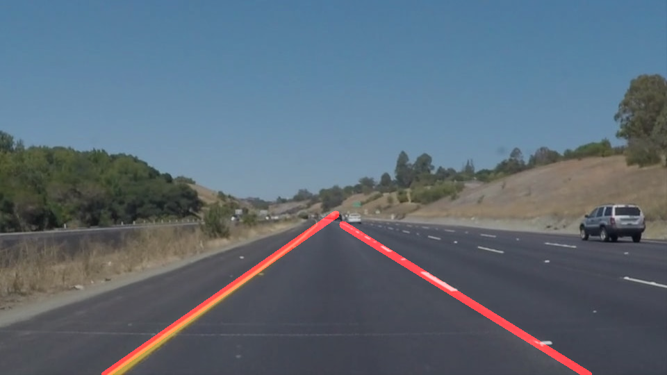

# SELF DRIVING CAR NANODEGREE
# project1. Finding Lane Lines


[//]: # (Image References)

[image2-1]: ./output_video.gif "RESULT_GIF_1"
[image2-2]: ./output_video_2.gif "RESULT_GIF_2"


## 1. Abstract

The object of the project is finding lanes at driving car videos

There are some conditions to pass the project

1. Use Canny edge detection

2. Use Hough transform

3. Draw straight lines on detected lines

4. Apply final function to video


## 2. Related Strudy

#### 1) Computer Vision Fundamentals

① Color selection : select using threshold

② Gaussian blur

③ Region masking

④ Canny edge detection

⑤ Hough transform


## 3. Details

#### 1) Make image to gray scale

It is much more effective using gray scale image rather than RGB channel


```python
import matplotlib.pyplot as plt
import matplotlib.image as mpimg
import numpy as np
import cv2
import math
%matplotlib inline
```
```python
def grayscale(img):

    return cv2.cvtColor(img, cv2.COLOR_RGB2GRAY)
```


#### 2) Apply Gaussian blur

It receive gray scaled image as input and return blured image

```python
def gaussian_blur(img, kernel_size):

    return cv2.GaussianBlur(img, (kernel_size, kernel_size), 0)
```




#### 3) Apply Canny edge detection

It receive blured image as input and return canny edge detected image

```python
def canny(img, low_threshold, high_threshold):

    return cv2.Canny(img, low_threshold, high_threshold)
```



#### 4) Apply region masking

Only keeps the region of the image defined by the polygon formed from `vertices`. 

The rest of the image is set to black.

`vertices` should be a numpy array of integer points.

```python
def region_of_interest(img, vertices):

    mask = np.zeros_like(img)   
    
    if len(img.shape) > 2:
        channel_count = img.shape[2]
        ignore_mask_color = (255,) * channel_count
    else:
        ignore_mask_color = 255
 
    cv2.fillPoly(mask, [vertices], ignore_mask_color)
    
    masked_image = cv2.bitwise_and(img, mask)
    
    return masked_image
```


#### 5) Apply Hough transform

Using Hough transform, receive masked image and draw lines on image

① Find lanes on Canny edge detected image using hough transform

```python
def hough_lines(img, rho, theta, threshold, min_line_len, max_line_gap):

    lines = cv2.HoughLinesP(img, rho, theta, threshold, np.array([]), 
                            minLineLength=min_line_len, maxLineGap=max_line_gap)
    line_img = np.zeros((img.shape[0], img.shape[1], 3), dtype=np.uint8)
    draw_lines(line_img, lines)
    
    return line_img
```

② Define draw_lines function : connect detected lines

```python
def draw_lines(img, lines, color=[255, 0, 0], thickness=10):
      
    right_line = []
    left_line = []
    
    right_x = []
    right_y = []
    left_x = []
    left_y = []
    
    for line in lines:
        for x1,y1,x2,y2 in line:
            if x1 > 480:
                right_line.append(line)
            else:
                left_line.append(line)
                
    for line in right_line:
        for x1,y1,x2,y2 in line:
            right_x.append(x1)
            right_x.append(x2)
            right_y.append(y1)
            right_y.append(y2)
    right_x_min = min(right_x)
    right_x_max = max(right_x)
    right_y_min = min(right_y)
    right_y_max = max(right_y)
    
    right_x1, right_y1, right_x2, right_y2 = cal_line_end_point_right(right_x_min, right_y_min, right_x_max, right_y_max)
       
    for line in left_line:
        for x1,y1,x2,y2 in line:
            left_x.append(x1)
            left_x.append(x2)
            left_y.append(y1)
            left_y.append(y2)
    left_x_min = min(left_x)
    left_x_max = max(left_x)
    left_y_min = min(left_y)
    left_y_max = max(left_y)          
    
    left_x1, left_y1, left_x2, left_y2 = cal_line_end_point_left(left_x_min, left_y_max, left_x_max, left_y_min)
    
    cv2.line(img, (right_x1, right_y1), (right_x2, right_y2), color, thickness)
    cv2.line(img, (left_x1, left_y1), (left_x2, left_y2), color, thickness)    
```

③ Define cal_line_end_point_left/right function : to extend lines to end point of image

```python
def cal_line_end_point_left(x1,y1,x2,y2):
    m = (y1-y2)/(x1-x2)
    if m != 0:
        x1_end = int((540 + m*x1 - y1)/m)
        y1_end = 540
        x2_end = x2
        y2_end = y2
    else:
        x1_end = 0
        y1_end = y1
        x2_end = x2
        y2_end = y2        
    
    return x1_end,y1_end,x2_end,y2_end

def cal_line_end_point_right(x1,y1,x2,y2):
    m = (y1-y2)/(x1-x2)
    if m != 0:
        x1_end = x1
        y1_end = y1
        x2_end = int((540 + m*x1 - y1)/m)
        y2_end = 540
    else:
        x1_end = x1
        y1_end = y1
        x2_end = 960
        y2_end = y2
    
    return x1_end,y1_end,x2_end,y2_end
```




#### 6) Draw lines on original image

```python
def weighted_img(img, initial_img, α=0.8, β=1., γ=0.):

    return cv2.addWeighted(initial_img, α, img, β, γ)
```




#### 7) Define process_image function : combine every function to apply video

```python
def process_image(image):
    
    image_gray = grayscale(image)
    image_blur = gaussian_blur(image_gray, kernel_size)
    image_canny = canny(image_blur, low_threshold, high_threshold)
    image_masking = region_of_interest(image_canny, vertices)
    image_hough = hough_lines(image_masking, rho, theta, threshold, min_line_len, max_line_gap)
    image_weighted = weighted_img(image_hough, image, α=0.8, β=1., γ=0.)    
    
    return image_weighted
```


#### 8) Make video

```python
white_output = 'test_videos_output/solidWhiteRight.mp4'

clip1 = VideoFileClip("test_videos/solidWhiteRight.mp4")
white_clip = clip1.fl_image(process_image) #NOTE: this function expects color images!!
%time white_clip.write_videofile(white_output, audio=False)
```


#### 9) Output video

```python
HTML("""<video width="960" height="540" controls>  <source src="{0}"> </video>""".format(white_output))
```


## 4. Results

This is gif images of final result


![alt text][image2-1]
![alt text][image2-2]


## 5. Discussion

#### 1) About Canny edge detection

Video I used now have always good condition road so that I can only apply Canny edge detection

But in real condition, there may appear so much unexpected conditions like non-pavement, shadow, unclear weather

Then it makes image gradient not clear, as a result I will not detect lines using this method


#### 2) About masking

In this method, I applied masking that restrict area detecting lines

Conversely thinking, that means if there were no lines in that area, I cannot find lines

So it cannot apply to real condition self-driving car

Maybe eventually I have to adapt machine learning to detect lines wherever it be


#### 3) Challenge video

Udacity provided challenge videos

That have various challenging condition like non-pavement, shadow

So if I want to use only canny edge detection, it maybe really hard tuning, and that condition may only good for that video

If time permits, I will apply algorithm to challenge videos not only using this method but also new method to detect lines


